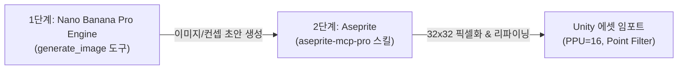

# [Project Gotblin] 리소스 제작 파이프라인 및 가이드라인 (RESOURCE_CREATION_GUIDELINE.md)

본 문서는 프로젝트 Gotblin의 캐릭터, 몬스터, 아이콘, 부락 건물, 배경 등 모든 그래픽 리소스를 새로 제작할 때 준수해야 하는 **도구 활용 파이프라인**과 **픽셀 규격 표준**을 정의합니다.

---

## 1. 2단계 리소스 제작 파이프라인 (Production Pipeline)

리소스 제작 요청을 받으면 반드시 아래 **2단계 공정**을 거쳐 제작을 진행합니다.

### 1단계: Nano Banana Pro Engine을 활용한 초안 이미지 제작
* **사용 도구**: `generate_image` (Nano Banana Pro 기반 이미지 생성 AI 도구)
* **수행 작업**:
  * 리소스 제작 요청 시 레퍼런스가 될 컨셉 이미지 및 원화를 1차적으로 생성합니다.
  * 프로젝트 특성(16비트 레트로 픽셀 아트 스타일)에 맞는 형태, 컬러 팔레트, 실루엣을 도출하도록 프롬프트를 구성합니다.

### 2단계: Aseprite를 활용한 픽셀화 및 다듬기 (Pixelation & Refining)
* **사용 도구**: Aseprite 에디터 및 `aseprite-mcp-pro` MCP 서버 스킬
* **수행 작업**:
  * 1단계에서 생성된 이미지를 바탕으로 프로젝트 규격에 맞게 픽셀화(Pixelation)를 진행합니다.
  * 아웃라인 정돈, 지저분한 노이즈 픽셀(Stray pixels) 제거, 컬러 팔레트 단순화 작업을 거칩니다.
  * 애니메이션 작업(대기, 이동, 공격 프레임 등)이 필요한 경우 Aseprite 타임라인을 통해 스프라이트 시트를 완성합니다.

---

## 2. 픽셀 해상도 및 사이즈 규정 (Pixel Resolution Standards)

* **기본 표준 사이즈**: **`32 x 32` 픽셀**
  * 일반 소형 고블린 유닛, 표준 몬스터, UI 아이콘, 일반 부락 오브젝트 등 대부분의 표준 에셋에 적용합니다.
* **가변 / 확장 사이즈**: **`64 x 64`, `128 x 128` 픽셀 등 (상황별 확장)**
  * 보스 몬스터, 대형 건물 에셋, 메인 영웅 캐릭터, 가로 스크롤 배경 요소 등 디테일 표현이나 크기 묘사가 필요한 경우 확장 픽셀 사이즈를 사용합니다.
  * 픽셀 사이즈가 커지더라도 픽셀 간 격자 비율(Pixel Ratio)의 일관성을 유지합니다.

---

## 3. Unity 에셋 정합성 및 기존 문서 연동 규칙

본 문서 규정은 기존 프로젝트 명세 문서들과 상호 보완되어 적용됩니다.

1. **[Project_Context_Master.md](file:///C:/Users/anyes/Gotblin2/Project_Context_Master.md) 연동 규칙**:
   * **Sprite Import Settings**:
     * `Pixels Per Unit (PPU)` = **`16`** 고정 (유니티 1단위당 16픽셀).
     * `Filter Mode` = **`Point (no filter)`** 고정 (픽셀 흐림 방지).
     * `Compression` = **`None` / `Uncompressed`** 고정.
   * **모듈러 계층 구조 준수**:
     * 캐릭터 리소스 제작 시 루트 이미지 대신 `BodyVisual`과 `Hand_Anchor`(무기)를 분리할 수 있는 형태로 스프라이트를 구성합니다.

2. **[AGENT_WORKFLOW_GUIDELINE.md](file:///C:/Users/anyes/Gotblin2/AGENT_WORKFLOW_GUIDELINE.md) 연동 규칙**:
   * 완성된 리소스를 씬/프리팹에 적용 후 `screenshot-game-view` 또는 `screenshot-scene-view`를 찍어 시각적으로 정돈되었는지 검증 후 사용자에게 보고합니다.

---

## 4. 관리 및 적용

이 가이드라인은 향후 프로젝트의 모든 리소스 작업(AI 에이전트 작업 및 직접 작업 포함) 시 기본 지침으로 적용됩니다.
